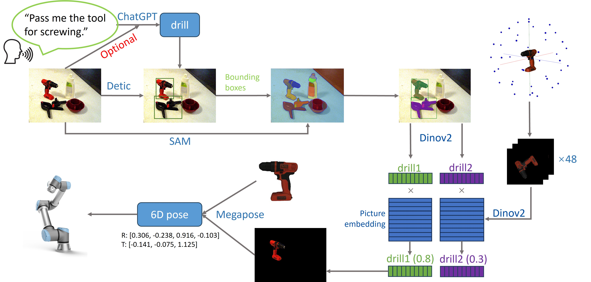

# HRC-ViTpose
 
This project combines our previously developed algorithm ViTpose, GPT4o and UR5e robot control to achieve a full pipeline of object pose estimation and robot control. The pipeline will request users to speak their requirements to the microphone. The voice command will be converted to text. Then, the camera will take a picture of the current scene and input the picture together with text to GPT4o to determine the object to be manipulated. The object pose will be estimated by ViTpose and guide the robot to grasp the object. The whole pipeline is illustrated in the following figure.



The following video is a system demonstration of our implemented system in the LISMS lab.
[](https://www.youtube.com/watch?v=jefZLsnaWiI)


## Development Environment Setup
System requirement: Ubuntu 20.04, Python version: Python3.9

Hardware requirement: NVIDIA GPU with 24GB memory, UR5e robot, Microsoft Azure Kinect Camera, Robotiq 2f85 parallel gripper, Robotiq FT300 force torque sensor
### Clone project
```shell
# create a catkin workspace
mkdir -p HRC_ViTpose/src && cd HRC_ViTpose/src
# clone the project
git clone https://github.com/WanqingXia/HRC_ViTpose.git .
# Incstall ROS
sudo apt-get install ros-noetic-desktop-full
```
### Create environment with conda
```shell
conda env create -f environment.yaml
conda activate HRC_ViTpose
```

### Python Dependencies Installation
```shell
conda install -c conda-forge rosdep firefox geckodriver pinocchio pyaudio

pip install torch==2.1.2 torchvision==0.16.2 torchaudio==2.1.2 --index-url https://download.pytorch.org/whl/cu121
pip install mmcv==2.1.0 -f https://download.openmmlab.com/mmcv/dist/cu121/torch2.1/index.html
pip install -U openmim
mim install "mmcv>=2.0.0"

pip install -r requirements.txt

pip install git+https://github.com/facebookresearch/segment-anything.git
pip install git+https://github.com/openai/CLIP.git
```

### ROS Dependencies Installation
```shell
sudo apt update -qq
rosdep update
rosdep install --from-paths Universal_Robots_ROS_Driver/ --ignore-src -y
rosdep install --from-paths fmauch_universal_robot/ --ignore-src -y
rosdep install --from-paths robotiq_85_gripper/ --ignore-src -y
```

### Other Dependencies
Azure Kinect SDK: follow instructions [here](https://github.com/microsoft/Azure-Kinect-Sensor-SDK/blob/develop/docs/usage.md#Installation)

ur_ikfast: follow instructions [here](https://github.com/cambel/ur_ikfast)

pykinect_azure: follow instructions [here](https://github.com/ibaiGorordo/pyKinectAzure)


### Download Pre-trained Models for ViTpose
```shell
cd src/ViTpose/vitpose_run/src

git clone https://github.com/facebookresearch/dinov2.git
git clone https://github.com/open-mmlab/mmdetection.git
cd mmdetection; pip install -e .; cd ..

mkdir models && cd models
# DINOv2 L14 without register weight
wget https://dl.fbaipublicfiles.com/dinov2/dinov2_vitl14/dinov2_vitl14_pretrain.pth
# SAM ViT_h weight
wget https://dl.fbaipublicfiles.com/segment_anything/sam_vit_h_4b8939.pth
# Detic weight
wget https://download.openmmlab.com/mmdetection/v3.0/detic/detic_centernet2_swin-b_fpn_4x_lvis-coco-in21k/detic_centernet2_swin-b_fpn_4x_lvis-coco-in21k_20230120-0d301978.pth

sudo -v ; curl https://rclone.org/install.sh | sudo bash
rclone copyto inria_data:megapose-models/ megapose-models/ --exclude="**epoch**" --config ../megapose/rclone.conf -P
cd ..
```

### Download YCBv dataset models

```shell
mkdir -p bop_datasets && cd bop_datasets
export SRC=https://huggingface.co/datasets/bop-benchmark/datasets/resolve/main
wget $SRC/ycbv/ycbv_base.zip         # Base archive with dataset info, camera parameters, etc.
wget $SRC/ycbv/ycbv_models.zip       # 3D object models.

unzip ycbv_base.zip             # Contains folder "ycbv".
unzip ycbv_models.zip -d ycbv     # Unpacks to "ycbv".
```

## Building project

```shell
cd HRC_ViTpose
catkin build # ur_calibration fails in building but it does not affect the project

echo 'source $HOME/HRC_ViTpose/devel/setup.bash' >> ~/.bashrc 
source ~/.bashrc
```

## Running the project
```shell
# run the following the commands in sequence
roslaunch ur_robot_driver ur5e_bringup.launch

roslaunch robotiq_85_bringup robotiq_85.launch

roslaunch robotiq_ft_sensor ft_sensor.launch

rosrun vitpose_run vision_ros.py

rosrun pycontrol pose.py
```

## Trouble shooting
1.Having trouble with communicate with robot

```bash
# disable firewall to communicate with robot
sudo ufw disable
```

2.Having trouble with controlling the gripper

```bash
# change permission for /tmp/ttyUR
sudo chmod -t /tmp
sudo chmod 777 /tmp/ttyUR
sudo chmod +t /tmp
```

3.Having trouble with controlling the Force/Torque sensor

```bash
# change permission for /dev/ttyUSB0
sudo chmod 777 /dev/ttyUSB0
```

## Contact
If you have any questions about this repository, please contact Wanqing Xia via email <wxia612@aucklanduni.ac.nz>
